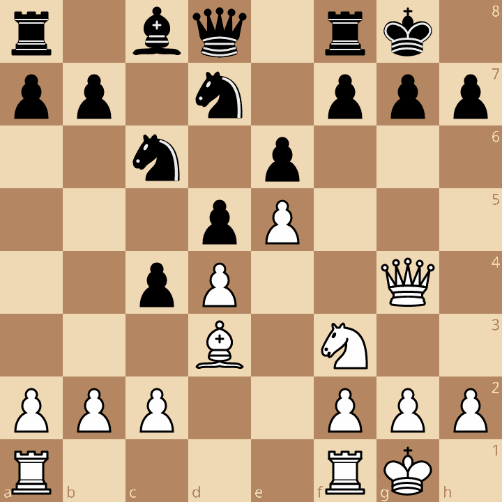
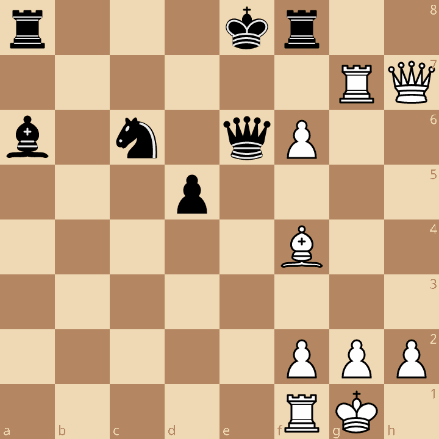

# ROŠÁDOVÝ ÚTOK - Obeť strelca na h7 (h2)

Jednou z najbežnejších a najpopulárnejších taktických operácií pri vedení útoku je obetovanie
strelca na h7 (h2), aby sa získalo dôležité tempo na vykonanie rýchleho útoku figúry na zvyčajne 
slabo chráneného súperovho kráľa. Cieľom obete je zvyčajne dať mat, alebo získanie rozhodujúceho materiálu.

## Príklady

### Tématický príklad


[Lichess](https://lichess.org/analysis/r2q1rk1/pp1n1ppp/2n1p3/3pP3/2pP2Q1/3B1N2/PPP2PPP/R4RK1_w_-_-_0_1?color=white)
```r2q1rk1/pp1n1ppp/2n1p3/3pP3/2pP2Q1/3B1N2/PPP2PPP/R4RK1 w - - 0 1```

Príklad ukazuje najjednoduchšiu obeť na h7:

**1.Sxh7+ Kxh7 (Kh8 2.Dh5) 2.Dh5+ Kg8 3.Jg5 Ve8**

<details><summary></summary></details>

Rýchlemu matu mohlo zabrániť iba 3. - Dxg5

**4.Dxf7+ Kh8 5.Dh5+ Kg8 6.Dh7+ Kf8 7.Dh8+ Ke7 8.Dxg7 mat**

Vo väčšine podobných pozícií stojí biela dáma na e2 alebo d1, takže biely hrá najprv Jg5+ a čierny môže ustúpiť na g6(h6), čo treba zohľadniť pri výpočte obranných možností súpera. V našom príklade sa tiež mohlo hrať 2.Jg5+ a po ústupe kráľa na g6 by to skončilo matom 2.Jg5+ Kg6 3.Jxe6+ Kh6 4.Dxg7+ Kh5 5.Jf4+ Kh4 6.g3 mat. V prípade ústupu na h6 tiež 2.Jg5+ Kh6 3.Dh4+ Kg6 4.Dh7+ Kxg5 5. f4+ Kg4 6. Dh3 mat.

### Greco - NN, 1620


[Lichess](https://lichess.org/analysis/pgn/e4_e6_d4_Nf6_Bd3_Nc6_Nf3_Be7_h4_O-O_e5_Nd5_Bh7_Kh7_Ng5_Bg5_hg5_Kg8_Qh5_f5_g6_Re8_Qh8_1-0#12)
[PGN](../games/greco_nn_1620.pgn)
```r1bq1rk1/ppppbppp/2n1p3/3nP3/3P3P/3B1N2/PPP2PP1/RNBQK2R w KQ - 1 7```

Druhý diagram je jedným z prvých príkladov obete na h7 a miniatúrou najsilnejšieho
hráča zo začiatku 17. storočia a prvého šachového profesionála.

**7.Sxh7+ Kxh7 8.Jg5+ Sxg5 9.hxg5+ Kg6 10.Dh5+ Kf5 11.Dh7+ g6 12.Dh3+ Ke4 13.Dd3 mat**

Partia ukazuje iný typ pozície pred obeťou,kde pešiak na h4 umožňuje po braní jazdca g5 otvoriť h-stĺpec s ešte väčšou účinnosťou. Niekedy ďalší strelec sprevádza obeť na h7 braním pešiaka g7,čím sa úplne odhalí kryt čierneho kráľa a umožňuje bielym ťažkým figúram dokončiť dielo skazy, ako to predviedol Lasker v partii s Bauerom v Amsterdame v roku 1889.

### Lasker - Bauer, Amsterdam 1889


[Lichess](https://lichess.org/analysis/pgn/f4_d5_e3_Nf6_b3_e6_Bb2_Be7_Bd3_b6_Nc3_Bb7_Nf3_Nbd7_O-O_O-O_Ne2_c5_Ng3_Qc7_Ne5_Ne5_Be5_Qc6_Qe2_a6_Nh5_Nh5_Bh7_Kh7_Qh5_Kg8_Bg7_Kg7_Qg4_Kh7_Rf3_e5_Rh3_Qh6_Rh6_Kh6_Qd7_Bf6_Qb7_Kg7_Rf1_Rab8_Qd7_Rfd8_Qg4_Kf8_fe5_Bg7_e6_Rb7_Qg6_f6_Rf6_Bf6_Qf6_Ke8_Qh8_Ke7_Qg7_Ke6_Qb7_Rd6_Qa6_d4_ed4_cd4_h4_d3_Qd3_1-0#28)
[PGN](../games/lasker_bauer_1889.pgn)
```r4rk1/1b2bppp/ppq1p3/2ppB2n/5P2/1P1BP3/P1PPQ1PP/R4RK1 w - - 0 15```

**1.Sxh7+ Kxh7 2.Dxh5 Kg8 3.Sxg7! Kxg7 4.Dg4+ Kh7 5.Vf3**


Hrozí Vh3 mat

**5. - e5 6.Vh3+ Dh6 7.Vxh6+ Kxh6 8.Dd7**


Pointa obete. Čierny zabráni matu,ale stratí ďalší rozhodujúci materiál

**8. - Sf6 9.Dxb7** 

a biely vyhrá.

Pri podobnej obeti dvoch strelcov treba počítať s možnosťou, že čierny druhú obeť neprijme.
V našej ukážke to mohlo byť

- [3. - f6](https://lichess.org/analysis/r4rk1/1b2b1B1/ppq1pp2/2pp3Q/5P2/1P2P3/P1PP2PP/R4RK1_w_-_-_0_18?color=white)
  <details><summary></summary></details>
   4.Vf3! De8 5.Dh8+ Kf7 6.Dh7

- [3. - f5](https://lichess.org/analysis/r4rk1/1b2b1B1/ppq1p3/2pp1p1Q/5P2/1P2P3/P1PP2PP/R4RK1_w_-_-_0_18?color=white)
  <details><summary></summary></details>
  4.Se5 Vf6 5.Vf3

v oboch prípadoch s rozhodujúcim útokom bieleho.

S touto obľúbenou obeťou sa stretávame stále a na rôznych výkonnostných úrovniach,ako ukazuje nasledujúci príklad z turnaja svetovej šachovej špičky v Las Palmas v roku 1996.

### Anand - Karpov, Las Palmas 1996


[Lichess](https://lichess.org/analysis/pgn/Nf3_d5_d4_e6_c4_dc4_e4_b5_a4_c6_ab5_cb5_b3_Bb7_bc4_Be4_cb5_Nf6_Be2_Be7_O-O_O-O_Nc3_Bb7_Ne5_a6_Bf3_Nd5_Nd5_ed5_Rb1_Qb6_Be2_ab5_Rb5_Qc7_Bf4_Bd6_Bd3_Ba6_Bh7_Kh7_Qh5_Kg8_Rb3_Be5_Rh3_f6_de5_Qe7_Qh7_Kf7_Rg3_Ke8_Rg7_Qe6_ef6_Nc6_Ra1_Kd8_h4_Bb7_Rc1_Ba6_Ra1_Bb7_Rd1_Ba6_Qb1_Rf6_Bg5_1-0#40)
[PGN](../games/anand_karpov_1996.pgn)
```rn3rk1/2q2ppp/b2b4/1R1pN3/3P1B2/3B4/5PPP/3Q1RK1 w - - 5 21```

Anand predchádzajúci deň prehral po nudnej partii s Kramnikom a rozhodol sa prekvapiť voľbou otvorenia. 1.Jf3 a po dvadsiatich ťahoch sa partia dostala na diagram 4. Biely má lepšiu hru a s 1.Vxd5 môže získať pešiaka. Je to obdivuhodné, že si namiesto toho zvolil efektnú, aj keď riskantnú cestu obete figúry.
Sám Anand napísal: _„Strávil som niekoľko sekúnd na 1.Vxd5, ale keď som videl možnosť 1.Sxh7+, bolo rozhodnuté. Súperova obrana sa mi nezdala dostatočná, najmä preto, že Karpov bol v časovej tiesni. Cítil som současně velké vzrušenie a obával sa mojej neschopnosti racionálnej analýzy. O to ľahšie bolo rozhodnutie."_

**1.Sxh7+ Kxh7 2.Dh5+ Kg8 3.Vb3! Sxe5?**


Prehráva,ale ani lepšie 3. - f6 neposkytlo dostatočnú obranu pre 4.Vh3
fxe5 5.dxe5 Dc4 6.Ve1 Dxf4 7.Dh7+ Kf7 8.exd6 Jc6 9.Vf3 atď. 

**4.Vh3 f6 5.dxe5 De7 6.Dh7+Kf7 7.Vg3 Ke8 8.Vxg7 De6 9.exf6 Jc6**



Čierny je stratený, navyše je vo vrcholnej časovej tiesni.

**10.Va1 Kd8 11.h4 Sb7 12.Vc1 Sa6 13.Va1 Sb7 14.Vd1 Sa6 15.Db1 Vxf6 16.Sg5**


Čierny prekročil svoj čas. Po 17.Db6 už nemá čo hrať.

## Samostatná práca: Analyzuj obeť 1.Sxh7+.

### 1. Schlechter – Wolf, Ostende 1905


<details>
<summary>Riešenie:</summary>
<div markdown="1">

**1.Sxh7+! Kxh7 2.Jg5+ Kg6!**

<details><summary></summary></details>

Ostatné ústupy sú slabšie
* Kg8 3.Dh5 Ve8 4.Dxf7+ Kh8 5.Je6 a čierny nemôže Vg8 pre 6.Dh5 mat
* Kh6 3.Dg4 Jg6(f5 4.exf6 gxf6) 4.f4 f5 5.Dh3+ Jh4 6.Dxh4+

**3.Dg4 f5 4.exf6 gxf6**

<details><summary></summary></details>

Prehráva i 4. – Vxf6 5.Je6+ Kf7 6.Dxg7+ Kxe6 7.Ve1+

**5.Je6+ Kf7 6.Dg7+ Kxe6 7.Ve1+ Kf5 8.Dh7+ Kg5 9.h4+ Kf4 10.Dh6+ Kg4 11.f3+**

Biely vyhrá

[Lichess](https://lichess.org/analysis/pgn/d4_d5_Nf3_Nf6_e3_c5_c4_e6_Bd3_Nc6_O-O_a6_Nc3_dc4_Bc4_b5_Bd3_Bb7_a4_c4_ab5_ab5_Ra8_Ba8_Bb1_Qb8_e4_Be7_Bg5_O-O_e5_Nd5_Nd5_ed5_Be7_Ne7_Bh7_Kh7_Ng5_Kg6_Qg4_f5_ef6_gf6_Ne6_Kf7_Qg7_Ke6_Re1_Kf5_Qh7_Kg5_Re7_Rg8_Re3_b4_Rg3_Qg3_Qg8_1-0#36)
[PGN](../games/schlechter_wolf_1905.pgn)
```
bq3rk1/4nppp/8/1p1pP3/2pP4/5N2/1P3PPP/1B1Q1RK1 w - - 0 19
```
</div>
</details>

### 2. Šapošnikov – Dvoirys, Samara 2000


<details>
<summary>Riešenie:</summary>
<div markdown="1">

**1.Sxh7+ Kxh7 2.Dh5+ Kg8 3.Jg6 Dd8 4.Je4 Jd3 5.Jg5! 1 – 0**

<details><summary></summary></details>

 (fxg5 6.Dh8+ Ke7 7.fxg5+ Ke8 8.Jxf8 +-)

 [Lichess](https://lichess.org/analysis/pgn/e4_c5_Nf3_d6_Bc4_Nf6_e5_de5_Ne5_e6_Qe2_Bd6_b3_O-O_Bb2_Nbd7_f4_Nd5_O-O_N7b6_Bd3_Qh4_g3_Qe7_c4_Nb4_Nc3_f6_Bh7_Kh7_Qh5_Kg8_Ng6_Qd8_Ne4_Nd3_Ng5_1-0#28)
[PGN](../games/shaposhnikov_dvoirys_2000.pgn)
```
r1b2rk1/pp2q1pp/1n1bpp2/2p1N3/1nP2P2/1PNB2P1/PB1PQ2P/R4RK1 w - - 0 15
```

</div>
</details>
