# ÚTOK NA KRÁĽA ZADRŽENÉHO V STREDE ŠACHOVNICE

Jednou z najdôležitejších zásad boja v zahájení je včasné vykonanie rošády a uvedenie
kráľa do bezpečia. Príliš dlhé vyčkávanie s rošádou môže byť príčinou prekvapivého
kombinačného útoku súpera. Nezriedka je útok spojený s obeťou materiálu s cieľom otvoriť
stredné stĺpce. Predčasné otvorenie hry môže viesť k zadržaniu kráľa v strede šachovnice.

### Khalifman – Svěšnikov, Rusko 1996

[Lichess](https://lichess.org/analysis/pgn/d4_d5_c4_e6_Nf3_c6_g3_Nf6_Bg2_dc4_O-O_b5_a4_Bb7_Ne5_Qb6_b3_cb3_Qb3_Nbd7_Be3_c5_Nd7_Nd7_d5_ba4_Qa4_ed5_Nc3_d4_Nd5_Bd5_Bd5_Rd8_Bf4_Qf6_Qb5_Bd6_Ra6_Rb8_Bb7_Bf4_Rf6_gf6_gf4_f5_Qc6_Kd8_Qd5_Kc7_Bc6_1-0#0)
[PGN](../games/khalifman_sveshnikov_1996.pgn)

**1.d4 d5 2.c4 e6 3.Jf3 c6 4.g3 Jf6 5.Sg2 dxc4 6.0-0**

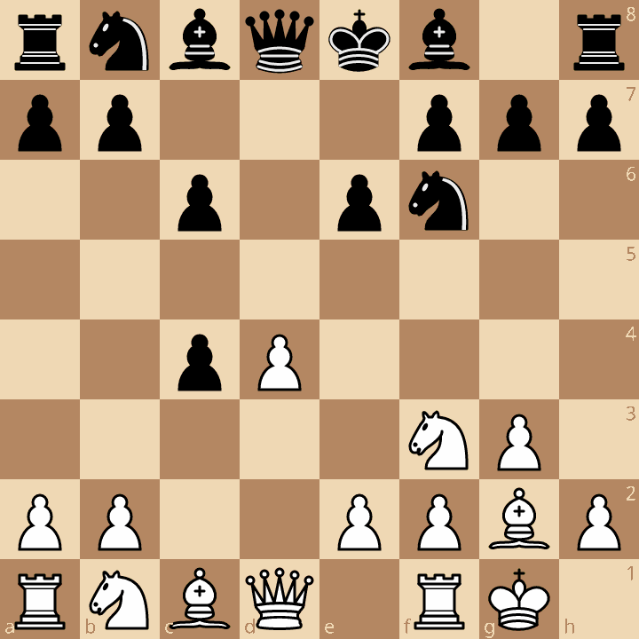

Inou možnosťou je 6.Je5 b5 7.a4 Jd5 8.e4 Jb4 9.0-0

**b5 7.a4 Sb7 8.Je5 Db6 9.b3!?**

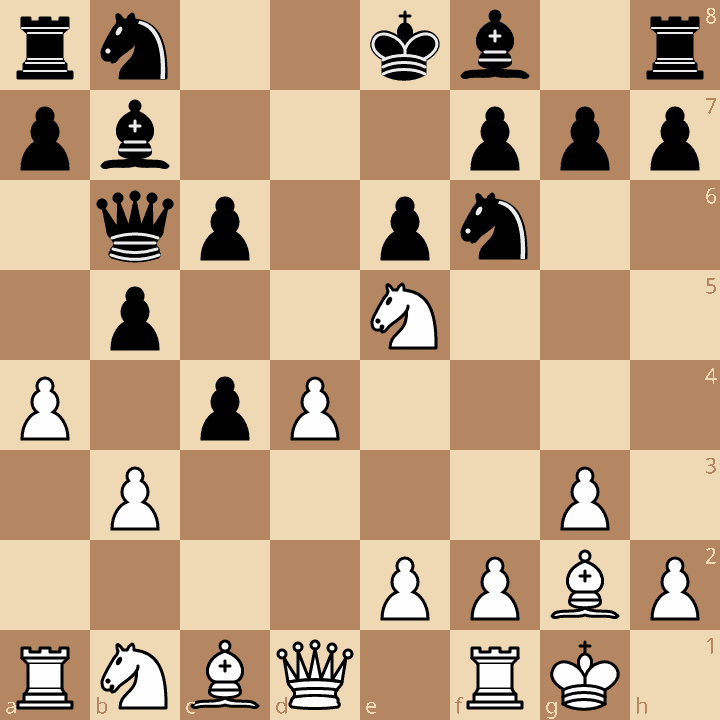

Častejšie se hráva 9.e4

**cxb3 10.Dxb3 Jbd7 11.Se3 c5?!**

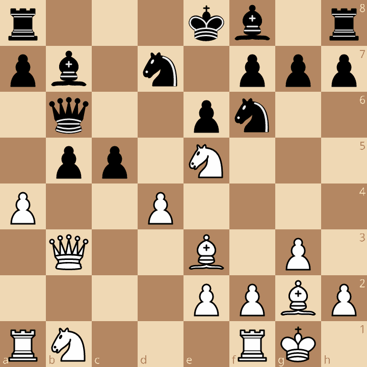

V rozpore so zásadou, že otvoriť hru v strede šachovnice má len strana s lepším
vývinom

**12.Jxd7 Jxd7**

Biely sa teraz rozhoduje medzi istým 13.Dxb5 Sxg2 14.Kxg2 cxd4
15.Dxb6 axb6 16.Sxd4 e5, vedúcim len k rovnej hre a riskantným, ale správnym..

**13.d5! bxa4**

K prevahe bieleho by viedlo exd5 14.Jc3 d4 15.a5 De6 16.Dxe6+ fxe6 17.Sxb7 Vb8 18.Sc6

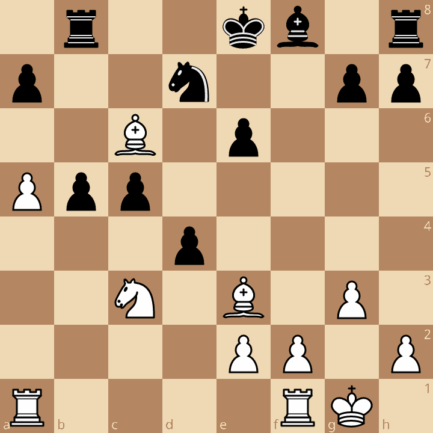

Čierny nemôže zobraťˇstrelca ani jazdca, lebo by prišlo Vd1. Vd8 nestačí na krytie jazdca na d7. Biely
ho jednoducho vezme vežou a potom postavi na d1 druhú vežu.

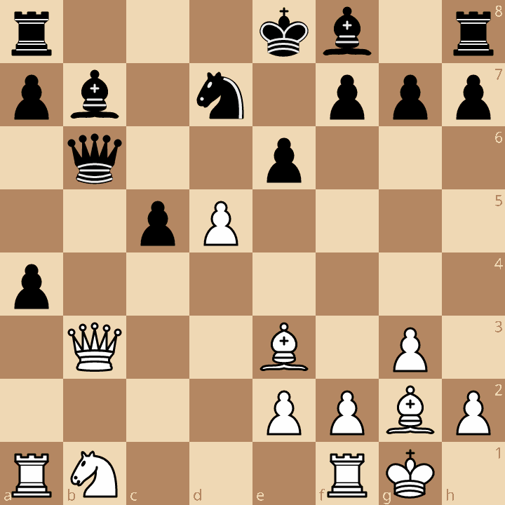

**14.Dxa4 exd5** (Sxd5 15.Sxd5 exd5 16.Jc3 d4 17.Sf4 nemôže dxc3 pre 18.De4+)

**15.Jc3 d4** (De6 16.Vfd1 Sc6 17.Sxd5!? Sxa4 18.Vxa4 Df6 19.Sxa8 s útokem bieleho)

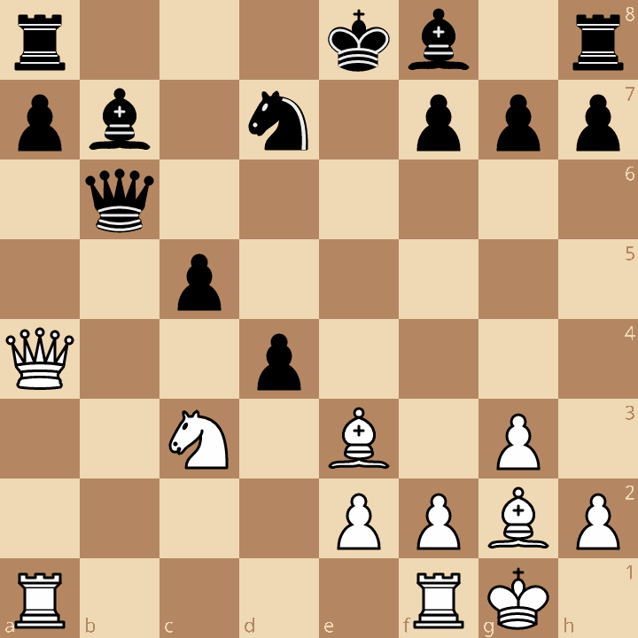

**16.Jd5!** (Nie 16.Vfb1 Sxg2!)

**Sxd5 17.Sxd5 Vd8 18.Sf4**

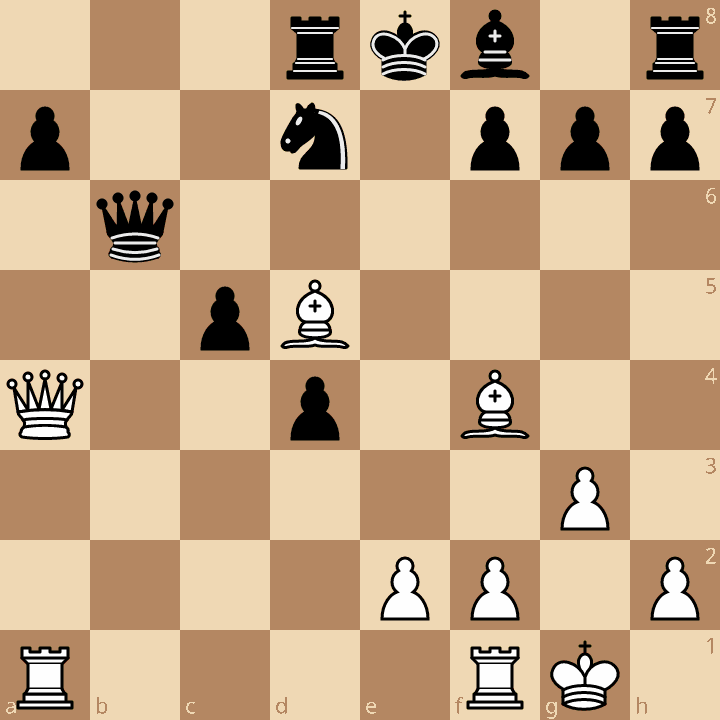

Biely má naďalej o dvoch pešiakov menej, ale v podstate dokončil vývin svojich síl a teraz hrozí preniknúť vežou na siedmu radu. Čierny nielen, že zaostal s vývinom, ale nie je schopný pokryť priamočiare hrozby bieleho.

**Df6 19.Db5!** 

Drži ďalej jazdca vo väzbe a uvoľnuje cestu veži.
Čo má čierny hrať? Nepomáha ani 19. - Se7 20.Sc6 De6 21.Vxa7 alebo 19. - Db6 20.Dc4

**Sd6 20.Va6 Vb8 21.Sb7 Sxf4**

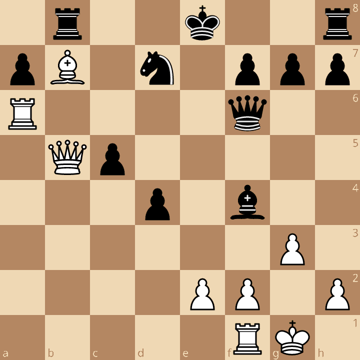

Priznanie porážky.

**22.Vxf6 gxf6 23.gxf4 f5 24.Dc6 Kd8 25.Dd5 Kc7 26.Sc6 1 – 0**

Pekná partia, demonštrujúca modernú metodu boja proti kráľovi v strede šachovnice. Za povšimnutie stojí, koľko je v nej rizika a aj nárokov na presný a chladný prepočet.

### Winants – Abbink, Haarlem 1997

[Lichess](https://lichess.org/analysis/pgn/e4_c5_Nf3_Nc6_Bb5_Nf6_e5_Nd5_O-O_g6_Nc3_Nc7_Re1_Nb5_Nb5_Bg7_d4_cd4_Nd6_Kf8_Nb5_Qa5_a4_a6_Nbd4_Ne5_Ne5_Be5_Bh6_Kg8_Nf5_f6_Ne7_Kf7_Nc8_1-0#0)
[PGN](../games/winants_abbink_1997.pgn)

**1.e4 c5 2.Jf3 Jc6 3.Sb5 Jf6 4.e5 Jd5 5.0-0 g6 6.Jc3 Jc7 7.Ve1!?**

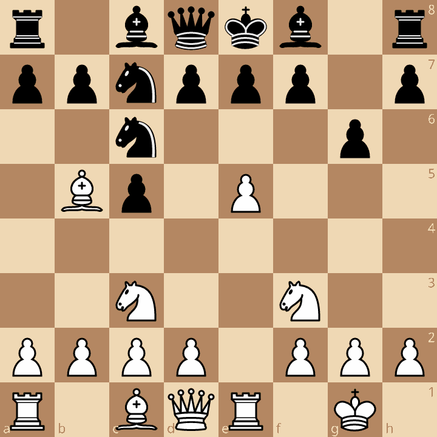

V tom čase nová myšlienka, spojená s pascou, do kterej čierny spadne. Bežne sa hrávalo 7.Sxc6

**Jxb5?**

Čierny buď netušil nebezpečenstvo, alebo provokoval. Mal pokračovať vo vývine(Sg7).

**8.Jxb5 Sg7 9.d4! cxd4 10.Jd6+!**

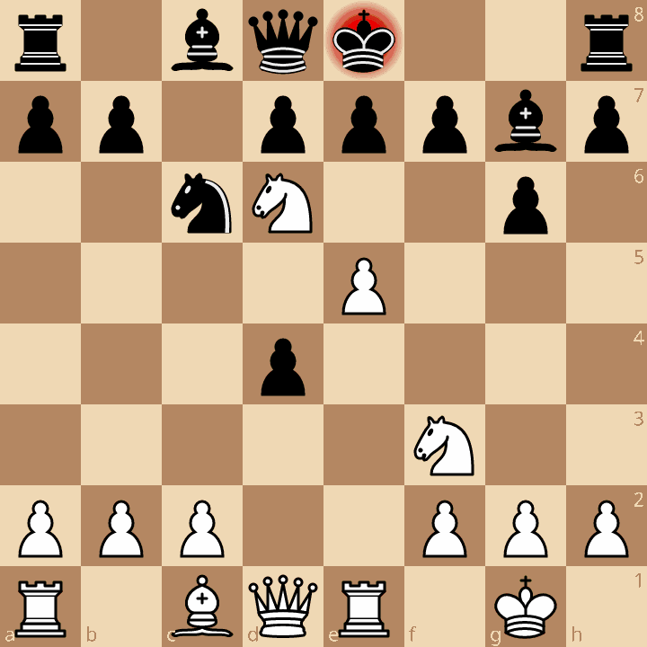

**10. - Kf8**

Smutný ústup po zistení, že 10. – exd6 11.Sg5! prehráva ihneď, napr. Da5 12.exd6+ Kf8 13.De2
Kg8 14.De8+ Sf8 15.Dxf8+ Kxf8 16.Sh6+ Kg8 17.Ve8 mat alebo 12. – Je5 13.Jxe5 0-0 14. Dxd4 s prevahou materiálnou i pozičnou. V partii Ricardi – Oblitas G., 2001, odevzdal čierny po 11.Sg5 ihned dámu tahem dxe5 a prehral rýchlo.

**11.Jb5 Da5 12.a4 a613.Jbxd4 Jxe5 14.Jxe5 Sxe5 15.Sh6+**

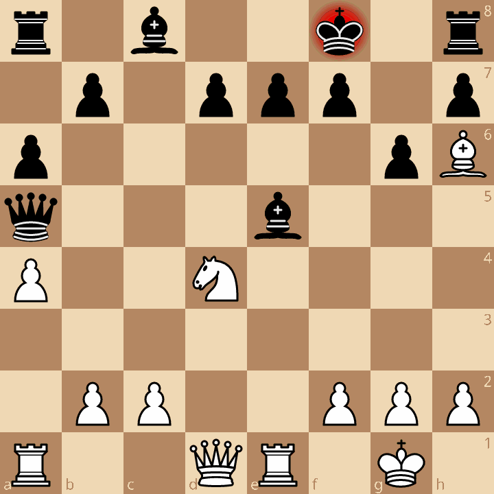

**15. - Kg8** (Možnosti bieleho po 15. – Ke8 a 15. – Sg7 sú domácou úlohou.) **16.Jf5!**

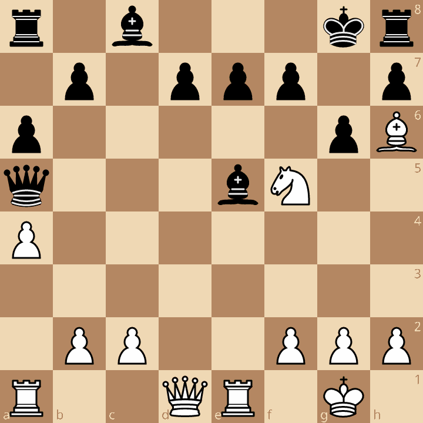

* gxf5 17.Dh5 Sf6 18.Ve3 f4 19.Dxa5 fxe3 20.Dd8 mat
* Dc5 17.Dd5 Dxd5 18.Jxe7 mat.

**f6 17.Jxe7+ Kf7 18.Jxc8**

a čierny sa vzdal, lebo nemôže 18. – Vxc8 pre 19.Dxd7+ Kg8 20.Dg7 mat.
Ostatné ťahy nepomáhajú o nič viac. A vraj romantika nie je v súčasnosti možná!

## Samostatná práca: Analyzuj možnosti bieleho po 15. – Ke8 a 15. – Sg7.

Riešenie:

### A. 15. – Sg7

**15. – Sg7 16.Sxg7 Kxg7**
  
Jednoduché 17.Vxe7 s prevahou bieleho, alebo este lepšie 
  
**17.Jb5! axb5 18.Dd4+**

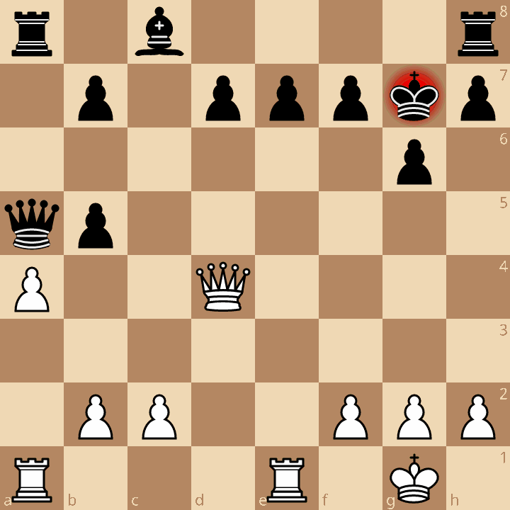

Po Kg7 vedie k matu Vxe7

### B. 15. – Ke8

je asi najlepší ťah čierneho

**15. – Ke8 16.Jb5**

a) **axb5 17.Vxe5**

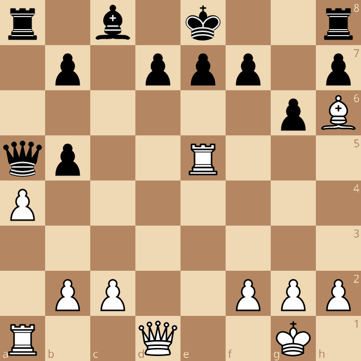

Čierny sa musi vysporiadať s hrozbami 18.Dd6 a 18. Ve7

napríklad 17. - f6 18. Vxb5 a biely stojí mierne lepšie.

b) **16. – f6 17.Vxe5!**

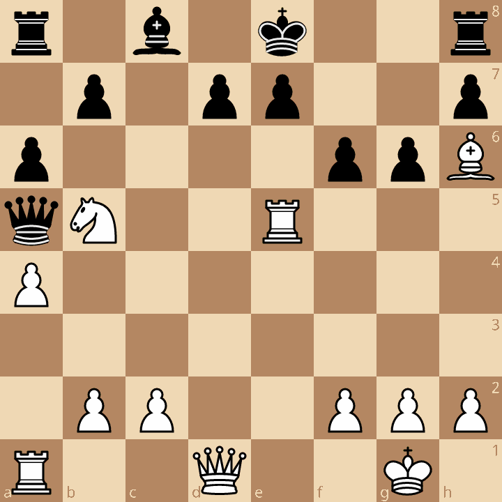

musí čierny nájsť správne axb5, lebo po

**fxe5 18.Jd6+ exd6 19.Dxd6**

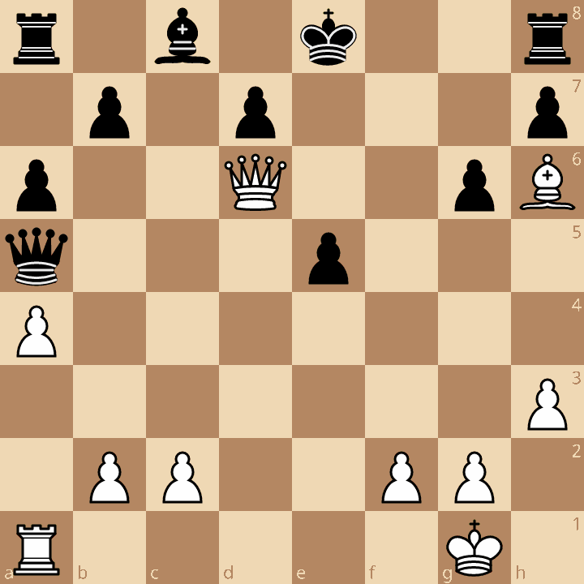

Hrozí Sg5, po 19.e4 najjednoduchšie vyhráva prevod strelca cez g7 na f6

