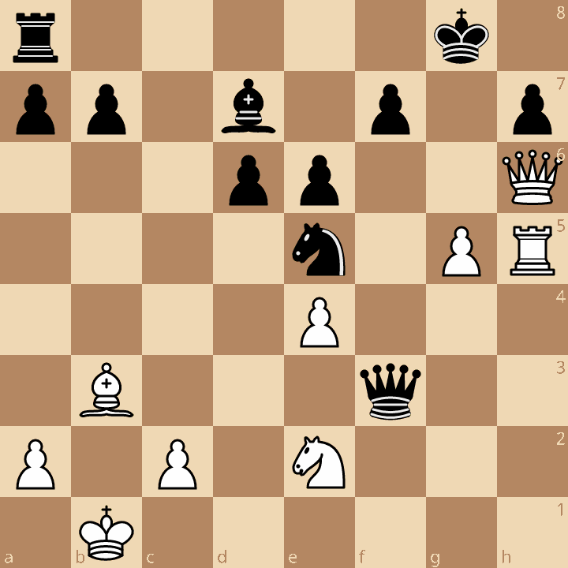

# ÚTOK NA KRÁĽA - ROŠÁDY NA OPAČNÚ STRANU

Pri rošádach na opačných krídlach dochádza spravidla k veľmi zložitému a ostrému boju. Obe strany sa snažia o rozvinutie útoku a vo výhode je strana, ktorej nástup je rýchlejší a dôraznejší. V takýchto prípadoch má význam rýchly postup pešiakov s cieľom uvoľnenia priestoru pre hlavné útočné sily, prípadne rozbitie pešiakového krytu súperovho kráľa. Útočiaca strana musí však zamedziť zablokovaniu pešiakových reťazí, čo komplikuje útočné snaženie a v takých prípadoch stojí za úvahu pešiakovú reťaz rozbiť obeťou figúry. Postupom pešiakov v tyle útočníka vznikajúce slabé polia sú bez významu, pretože kráľ stojí na krídle opačnom.

## Príklady

### Spasskij - Petrosjan, Moskva, 1969

[Lichess]( https://lichess.org/analysis/pgn/e4_c5_Nf3_d6_d4_cd4_Nd4_Nf6_Nc3_a6_Bg5_Nbd7_Bc4_Qa5_Qd2_h6_Bf6_Nf6_O-O-O_e6_Rhe1_Be7_f4_O-O_Bb3_Re8_Kb1_Bf8_g4_Ng4_Qg2_Nf6_Rg1_Bd7_f5_Kh8_Rdf1_Qd8_fe6_fe6_e5_de5_Ne4_Nh5_Qg6_ed4_Ng5_1-0#0)
[PGN](../games/spassky_petrosian_1969.pgn)

**1.e4 c5 2.Jf3 d6 3.d4 cxd4 4.Jxd4 Jf6 5.Jc3 a6 6.Sg5 Jbd7 7.Sc4 Da5 8.Dd2 h6?!**


Porážka čierneho v tejto partii prispela k tomu, že ťah 8. - h6 "odišiel" do ústrania a bežne je hrané 8. – e6

 **9.Sxf6 Jxf6 10.0-0-0**


Náskok bieleho vo vývine začína byť zreteľný.

**10. - e6 11. Vhe1 Se7**


Plán s malou rošádou čierneho je zlý, biely bude rýchlejší. Lepšie bolo vyčkávací 11. – Sd7 s prípadnou 0-0-0

**12.f4 0-0 13.Sb3 Ve8 14.Kb1 Sf8 15.g4!**


Po preventívnych ťahoch začína útok bieleho

**15. - Jxg4?!**

Odvážne,ale lepšie bolo 15. – e5 16.Jf5 Sxf5 17.gxf5, ale aj tak stojí biely lepšie.

**16.Dg2 Jf6**

alebo 16. – e5 17.Jf5 Sxf5 18.exf5 Jf6 19.Dxb7

**17.Vg1 Sd7 18.f5**


S cieľom otvoriť f-stĺpec aj uhlopriečnu a2-g8, súčasne hrozí 19.fxe6 fxe6 20.Jf5

**18. – Kh8(?)**

V pôvodnom materiále je poznámka
*Prekvapujúca chyba u tak znamenitého obrancu, akým bol Petrosjan. Väčší odpor mohol klásť po 18. – exf5 19.exf5 b5 20.Dg6 Kh8 21.Sxf7 b4*

Stockfish vidí 20.Sxf7! s výhrou bieleho, a ťah 18. - Kh8 ešte nepokladá za rozhodujúcu chybu.

**19.Vdf1**
S očividnou hrozbou 20.fxe6 fxe6 21.Vxf6


**19.Dd8**

Až toto je rozhodujúca chyba. Po 19. – De5 20.Jf3 Dc5 by sa ešte bojovalo.

**20.fxe6 fxe6 21.e5! dxe5 22.Je4**


Je rozhodnuté, čierny je bez obrany. Hrozí Vxf6.

**22. - Jh5 23.Dg6! exd4**


Po Jf4 mohlo nasledovať 24.Vxf4! exf4 25.Jf3 Db6 26.Vg5! Sc6 27.Jf6 Se4 28.Dxh6+!!

**24.Jg5!** a čierny sa vzdal. Matu zabráni iba obeťou dámy.

## Samostatná práca:

### 1. Karpov - Gik, Moskva 1969 



Navrhni najsilnejšie pokračovanie bieleho.

<details>
<summary>Riešenie:</summary>
<div markdown="1">

1.g6! Jxg6 1. – fxg6 2.Dxh7+ Kf8 3.Dh8+ Ke7 4.Vh7+ Jf7 5.Dxa8 +--  2.Dxh7+ Kf8 
3.Vf5!! Dxb3+ 4.axb3 exf5 5.Jf4! Vd8 6.Dh6+ Ke8 7.Jxg6 a bílý vyhraje. 

[Lichess](https://lichess.org/analysis/pgn/e4_c5_Nf3_d6_d4_cd4_Nd4_Nf6_Nc3_g6_Be3_Bg7_f3_O-O_Bc4_Nc6_Qd2_Qa5_O-O-O_Bd7_h4_Ne5_Bb3_Rfc8_h5_Nh5_Bh6_Bh6_Qh6_Rc3_bc3_Qc3_Ne2_Qc5_g4_Nf6_g5_Nh5_Rh5_gh5_Rh1_Qe3_Kb1_Qf3_Rh5_e6_g6_Ng6_Qh7_Kf8_Rf5_Qb3_ab3_ef5_Nf4_Rd8_Qh6_Ke8_Ng6_fg6_Qg6_Ke7_Qg5_Ke8_ef5_Rc8_Qg8_Ke7_Qg7_Kd8_f6_1-0#46)
[PGN](../games/karpov_gik_1968.pgn)
```r5k1/pp1b1p1p/3pp2Q/4n1PR/4P3/1B3q2/P1P1N3/1K6 w - - 0 24```
</div>
</details>

### 2. Lanka  - Fedorov, Kišiněv 1998


Nájdi vyhrávajúce pokračovanie čierneho a uveď varianty.

<details>
<summary>Riešenie:</summary>
<div markdown="1">

1.– Df5+!! Nádherná oběť dámy!2.Jxf5 Sxf5+ 3.Ka1 3.Kc1 bxc3 4.Dxd5 Vxf4 5.b3 Sg5 
6.Vdg1 Vg4+ 7.f4 Sxf4+ 8.Kd1 Ve8 a vyhr bxc3 4.bxc3 Vxf4! Sxc3? 5.Dxc3 Vxc3 6.Se5 
f6 7.Sxc3 Vxc3 8.Vxd5 + 5.Vc1 Vxf3 6.Kb2 d4 7.c4 Vb8+ 8.Ka1 d3 9.Vc3 Vf2!  0 – 1 
Vyhrávalo i prozaické 1. – Sf5+ 2.Ka1 bxc3 3.bxc3 De7 4.Dh2 Vxc3  nebo 4. Jxf5 Da3!!, 
vždy s vítězným útokem černého. 

[Lichess](https://lichess.org/analysis/pgn/e4_c5_Nf3_d6_d4_cd4_Nd4_Nf6_Nc3_g6_Be3_Bg7_f3_O-O_Bc4_Nc6_Qd2_Bd7_O-O-O_Rc8_Bb3_Na5_Kb1_Nc4_Bc4_Rc4_g4_b5_Qd3_Qb8_g5_Nh5_Nd5_e6_Nf6_Nf6_gf6_Bf6_h4_Rfc8_h5_d5_hg6_hg6_ed5_ed5_Qd2_Qe5_c3_b4_Bf4_Qf5_Nf5_Bf5_Ka1_bc3_bc3_Rf4_Rc1_Rf3_Kb2_d4_c4_Rb8_Ka1_d3_Rc3_Rf2_0-1#51)
[PGN](../games/lanka_fedorov_1998.pgn)
```2r3k1/p2b1p2/5bp1/3pq3/1prN1B2/2P2P2/PP1Q4/1K1R3R b - - 1 26```
</div>
</details>